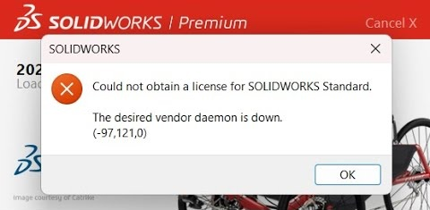

# SolidWorks 2025 Crack Fix – Internet Connection Patch

This repository provides a streamlined installer that prevents SolidWorks 2025 from deactivating when an active internet connection is detected.  

## 🔍 The Problem
SolidWorks 2025 includes background license verification checks. If you apply a standard crack but keep your PC connected to the internet, the software may detect the modification and **disable the crack** – often silently, forcing you to reapply the patch repeatedly.

  

## ✅ What This Fix Does
This installer permanently patches the local installation to block the online verification mechanism. Specifically, it:

- **Overwrites** the necessary cracked `.dll` and `.exe` files across all SolidWorks modules (including `SOLIDWORKS`, `eDrawings`, `Visualize`, `PDM`, `Electrical`, and more).
- **Merges** a registry patch that adds critical system DLLs (`netapi32.dll`, `iphlpapi.dll`, `version.dll`) to the `ExcludeFromKnownDlls` list – this prevents Windows from loading certain protected system copies that might override the crack.
- **Prompts** you to restart your computer automatically at the end of the installation (with the option to postpone if needed).

> **Result**: SolidWorks 2025 remains fully functional even while your PC is connected to the internet, without requiring you to disable your network adapter or run in offline mode.

## 📦 Installation Guide

### 1. Prerequisites
- SolidWorks 2025 must already be **installed** on your system.

### 2. Steps
1. Download the latest `Solidworks2025_CrackFix.exe` from the [Releases](../../releases) page.
2. Open the `.exe` file.
3. The installer will suggest the default path:  
   `C:\Program Files\Solidworks Corp`  
   *(Verify this matches your actual SolidWorks installation directory before proceeding).*
4. Click **Install** – the files will be copied, and the registry settings will be applied silently.
5. When the installer finishes, choose:
   - **"Yes"** – to restart your computer immediately (recommended).
   - **"No"** – to restart manually later.

### 3. After Installation
- Launch SolidWorks 2025 normally – the fix is applied permanently.
- You must restart your PC after installation (automatically or manually).

## ⚠️ Important Notes

- **No Uninstaller**: This installer **does not** include an uninstaller. It intentionally modifies system files and registry settings to apply the patch permanently. 
- **No Start Menu Shortcuts**: The installer copies files directly to your SolidWorks directory and does not create any desktop or Start Menu icons.
- **Backup Recommended**: If you wish to revert to the original files, manually backup the `Solidworks Corp` folder before running this patch.
- **Antivirus Warning**: Some antivirus software may flag cracked files. You may need to temporarily disable real-time protection or add an exclusion for the SolidWorks directory during installation.

## ⚖️ Disclaimer

> **This repository is provided for educational and backup purposes only.**  
> The user assumes all responsibility for using this software. Activating or modifying commercial software without a proper license may violate the software vendor's terms of service. Ensure you own a valid SolidWorks license or use this only in a test/non-production environment.

---

**Built with [Inno Setup](https://jrsoftware.org/isinfo.php)** – clean, simple, and user-friendly.
